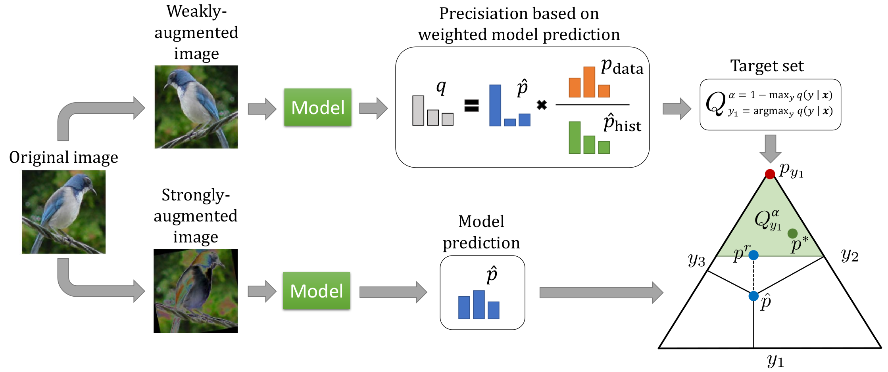

# Credal Self-Supervised Learning

This repository is the official implementation of [Credal Self-Supervised Learning](https://arxiv.org/abs/2106.11853) by Julian Lienen and Eyke Hüllermeier (to appear at NeurIPS 2021). 



Please cite this work as follows:

```
@InProceedings{Lienen2021_CSSL,
    author    = {Lienen, Julian and H\"ullermeier, Eyke},
    title     = {Credal Self-Supervised Learning},
    booktitle = {Advances in Neural Information Processing Systems 34: Annual Conference on Neural Information Processing Systems, {NeurIPS}, December 6-14, 2021, virtual},
    year      = {2021}
}
```

## Preface

As discussed in the paper, our method builds on top of the semi-supervised learning framework FixMatch [1]. Therefore, we re-used the [official implementation](https://github.com/google-research/fixmatch) (Apache 2.0 license) for various baselines, models, augmentation strategies and the evaluation.

As we want to clearly differentiate between our contributions and re-used content, we did not include (most of) the original project code here and focus solely on our extensions. As a consequence, one has to clone the aforementioned FixMatch repository and merge it with our project to run our code (agree to overwrite). We used the [_dberth-tf2_](https://github.com/google-research/fixmatch/tree/dberth-tf2) branch, which provides a version for TensorFlow 2.*. For some files, we kept the code of the original implementation. However, we have added a note on what we have extended in this file, which allows for tracking our changes.

By the discussed means, we want to acknowledge the contributions by the authors of FixMatch properly. We gratefully appreciate their work.

## Requirements

### Clone FixMatch repository

Please make sure to clone the [official FixMatch repository](https://github.com/google-research/fixmatch), checkout the branch _dberth-tf2_ and merge this project content with the FixMatch repository (agree to overwrite). We did not include the original repository content here for the reasons mentioned above.

### Package dependencies

To install all required packages, you need to run
```
pip install -r requirements.txt
```

The code has been tested using Python 3.6, 3.8 and 3.9 on Ubuntu 18.* and Ubuntu 20.* systems. The used TensorFlow version was 2.4.1 and 2.5.0. However, we expect this code to also be runnable on other operating systems, such as Windows and MacOS, as well as other TF version >= 2. We ran our experiments on Nvidia GPUs (Titan RTX, V100 and RTX 2080 Ti / GTX 1080 Ti) using CUDA 11.1 (driver version 455.23.05). We recommend to use [Python virtual environments](https://docs.python.org/3/tutorial/venv.html) to get a clean Python environment for the execution without any dependency problems.

### Datasets

To install the datasets for all the experiments, we point to the script provided [here](https://github.com/google-research/fixmatch#install-datasets). Please note that you need to export `ML_DATA` and `PYTHONPATH` as environment variables for a proper execution (also included in the linked script).

## Training

To train and evaluate models, you need to run the following from the project root:

```
export ML_DATA="path where you stored the datasets as constructed before"
export PYTHONPATH=$PYTHONPATH:.
```

For the actual training (e.g., of CSSL in its raw form on CIFAR-10 with 40 labels, seed 2 and a single validation sample [for faster execution]), you have to call the following function:

```
CUDA_VISIBLE_DEVICES=<the numeric ID(s) of your CUDA device(s) (comma-separated)> python cssl.py --filters=32 --dataset=cifar10.2@40-1 --train_dir ./experiments/cssl 
```

By default, the WRN-28-2 architecture with 32 filters is used. For the experiments on CIFAR-100, we used the variant with 128 filters (simpy pass `--filters=128`). The `--augment` parameter allows to specify the concrete form of augmentation (e.g., to switch from CTAugment to RandAugment). We refer to the original README [here](https://github.com/google-research/fixmatch#running) for further details, e.g., on how to use multi-GPUs or the concrete syntax of augmentation schemes.

Let us further note that we recommend to use [mixed precision](https://www.tensorflow.org/guide/mixed_precision), as it can drastically speed up the execution on newer Nvidia devices. We could notify a speedup also when used for this project.

## Evaluation

To evaluate the accuracy and ECE of a trained model, you can use the respective scripts `scripts/extract_accuracy.py` (in the FixMatch repo) and `scripts/extract_ece.py` (added in our repo). To calculate the (averaged) results on the last 1, 10, 20 (we report these in our results) and 50 epochs, simply call:

```
./scripts/extract_{accuracy,ece}.py ./experiments/fixmatch/cifar10.d.d.d.2@40-1/CTAugment_depth2_th0.80_decay0.990/FixMatch_archresnet_batch64_confidence0.95_filters32_lr0.03_nclass10_repeat4_scales3_uratio7_wd0.0005_wu1.0/
```

For the efficiency experiments, one has to change the statement 
```
model.train(FLAGS.train_kimg << 10, FLAGS.report_kimg << 10)
```
in the `main` method for each baseline to the number of updates being considered in the experiments. More precisely, we used 1/8 of the original iterations for CIFAR-10 (hence, one has to replace `10` by `7`), whereas we used 1/32 iterations for SVHN (replace `10` by `5`). For some experiments, we used `2^19` runs, which would correspond to `9` as the insertion.

## License

Our code uses the Apache 2.0 License, which we attached as `LICENSE` file in this repository. 

Feel free to re-use our code. We would be happy to see our ideas put into practice.

## References

[1]: Sohn, K., _et al_. FixMatch: Simplifying Semi-Supervised Learning with Consistency and Confidence. NeurIPS, 2020.